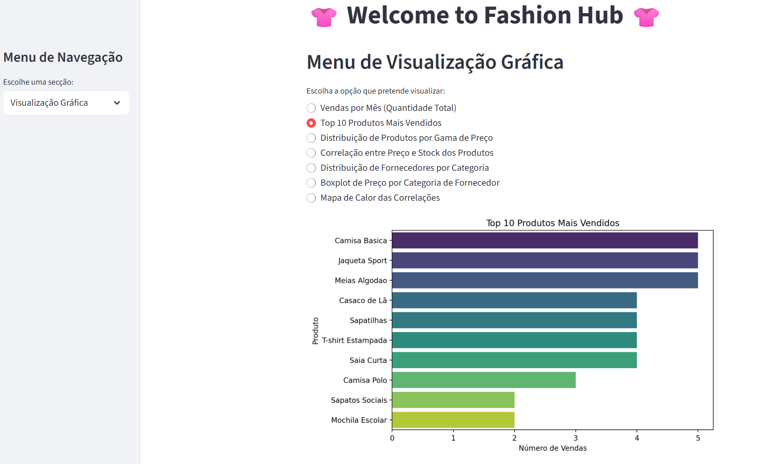
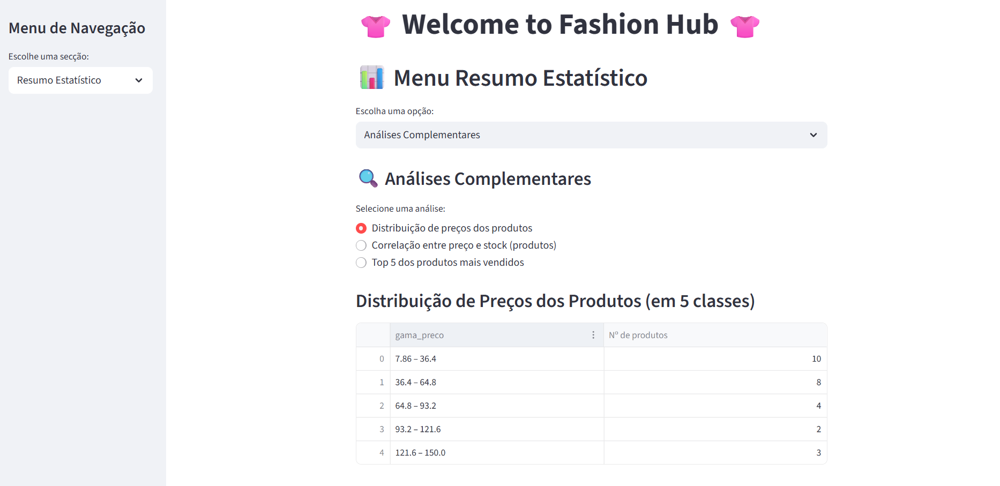
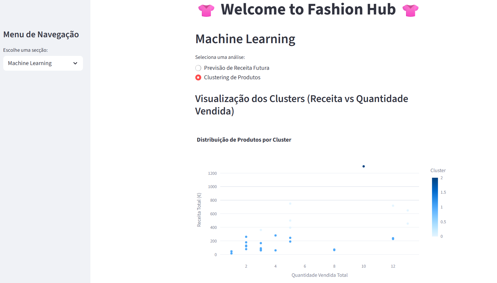

# 👚 Fashion Hub - Sistema de Análise de Dados

Projeto final da UFCD 10811 - Projeto de análise de dados para uma loja de moda.

## 📋 Descrição

Sistema completo de análise de dados com interface Streamlit e gestão de base de dados MySQL. Inclui autenticação, visualizações gráficas e previsões com Machine Learning.

## 📸 Screenshots

### Dashboard - Visualização Gráfica


### Dashboard - Resumo Estatístico


### Dashboard - Machine Learning


---

## 🎯 Funcionalidades

### 1. **Login com Autenticação**
- Sistema de login seguro com utilizadores de diferentes categorias (Funcionário, Gerente)
- Logging de todas as atividades
- Gestão de sessões

### 2. **Gestão de Base de Dados (CRUD)**
- **Clientes**: Listar, adicionar, atualizar, remover
- **Fornecedores**: Gestão de fornecedores e categorias
- **Produtos**: Controlo de stock e preços
- **Vendas**: Registo de transações

### 3. **Dashboard Streamlit**
- Visualizações gráficas em tempo real
- Vendas por mês
- Top 10 produtos mais vendidos
- Distribuição de preços e stock
- Análises de correlações

### 4. **Machine Learning**
- Previsão de receita futura (3 meses)
- Clustering de produtos

### 5. **Limpeza de Dados (UFCD 10808)**
- Tratamento de dados em falta
- Validação de email, telefone
- Formatação de datas

## 📦 Instalação

### Requisitos
- Python 3.10+
- MySQL Server

### Passos

1. Clone o repositório:
```bash
git clone https://github.com/seu-utilizador/fashion-hub.git
cd fashion-hub
```

2. Instale as dependências:
```bash
pip install -r requirements.txt
```

3. Crie a base de dados MySQL:
```bash
mysql -u root -p < loja1.sql
```

## 🚀 Uso

### Executar o Menu Principal
```bash
python projetofinal.py
```

### Executar o Dashboard Streamlit
```bash
streamlit run projeto.py
```

Ou a partir do menu principal: escolha a opção "Visualização Gráfica e Machine Learning"

## 📁 Estrutura do Projeto

```
├── projetofinal.py          # Menu principal e gestão de dados
├── projeto.py               # Dashboard Streamlit
├── graficos.py              # Funções de visualização
├── estatisticas.py          # Análises estatísticas
├── ml.py                    # Modelos de Machine Learning
├── log.py                   # Sistema de logging
├── loja1.sql                # Script de criação da BD
├── requirements.txt         # Dependências Python
├── clientes.csv             # Dados brutos (clientes)
├── fornecedores.csv         # Dados brutos (fornecedores)
├── produtos.csv             # Dados brutos (produtos)
├── vendas.csv               # Dados brutos (vendas)
└── README.md                # Este ficheiro
```

## 🔧 Configuração da Base de Dados

Primeira execução com dados:

1. Execute a função de limpeza:
```python
limpar_tratar_dados()
```

2. Insira os dados na BD:
```python
inserir_dados_bd(clientes, fornecedores, produtos, vendas)
```

## 👥 Utilizadores Padrão

Verifique o ficheiro `utilizadores.csv` para as credenciais de login.

**Categorias:**
- Funcionário: Acesso ao menu de tabelas (CRUD)
- Gerente: Acesso completo (tabelas + análises + ML)

## 📊 Tecnologias

- **Python 3.10**
- **Pandas** - Análise de dados
- **NumPy** - Computação numérica
- **Matplotlib/Seaborn** - Visualizações estáticas
- **Plotly** - Gráficos interativos
- **Streamlit** - Dashboard web
- **Scikit-learn** - Machine Learning
- **MySQL Connector** - BD relacional
- **BeauPy** - Menus interativos

## ⚠️ Notas de Segurança

- **Nunca fazer commit de credentials!** O `.gitignore` já exclui `projetofinal.py`
- Use variáveis de ambiente para passwords em produção
- Implemente validação adicional de inputs em produção

## 📝 Logs

Todas as atividades são registadas em `logs.txt`:
- Tentativas de login
- Operações na BD (inserção, edição, remoção)
- Erros de validação

## 🎓 Projeto Académico

UFCD 10811 - Projeto de análise de dados
Centro de Ensino: CESAE

## 📄 Licença

[Escolha a sua licença]

## ✉️ Contacto

[Seu contacto/email]

---

**Última atualização:** 2026-06-19
